# 📌 Proyecto: Sistema de Beneficiarios

## 📖 Descripción del proyecto

Este proyecto es una aplicación web desarrollada con **Next.js** que permite gestionar información de beneficiarios, convocatorias,discapacidades, edades, grupos etnicos, generos, sisben, programas, instituciones y localidades.

La aplicación se conecta a una base de datos MySQL alojada en Railway, permitiendo operaciones CRUD desde APIs internas.

---

## 🛠️ Tecnologías utilizadas

- Next.js
- React
- Node.js
- MySQL (Railway)
- API Routes (Next.js)

---

## 📸 Capturas del sistema

### 🏠 Página principal
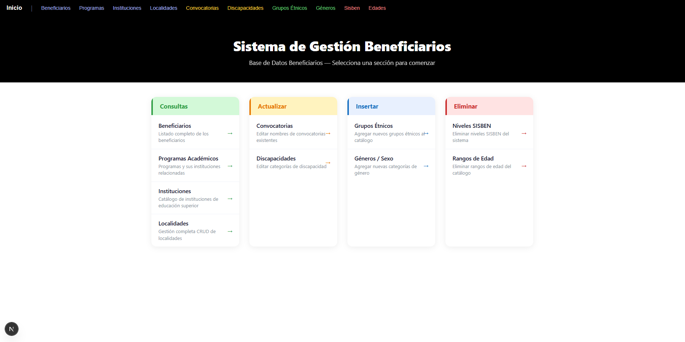

---

### 📋 Listado de beneficiarios
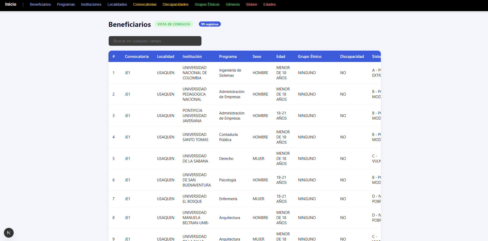

---

### 📊 Programas
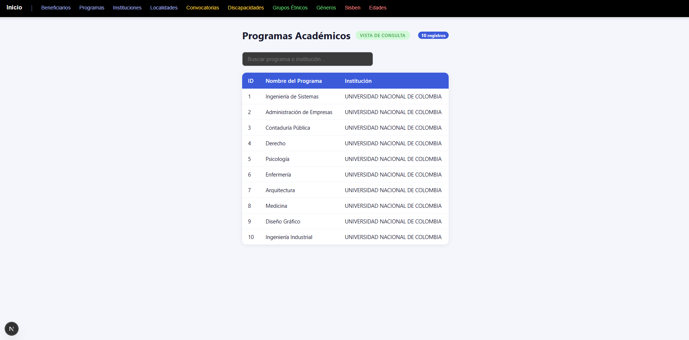

---

### 🏫 Instituciones
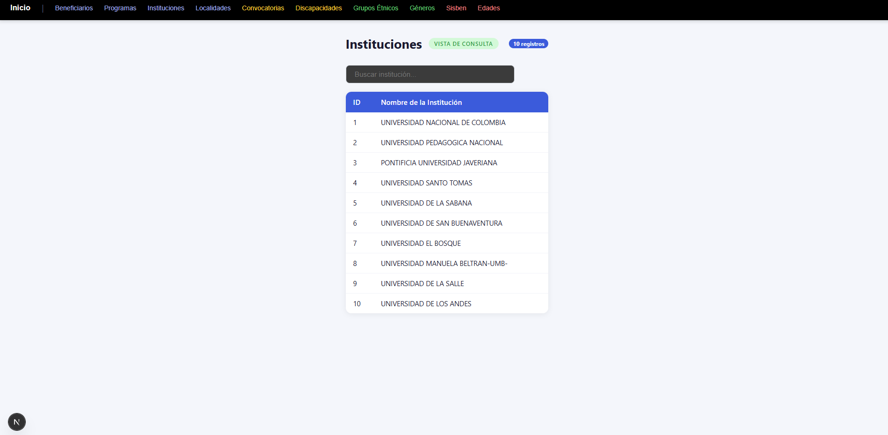

---

### 📍 Localidades
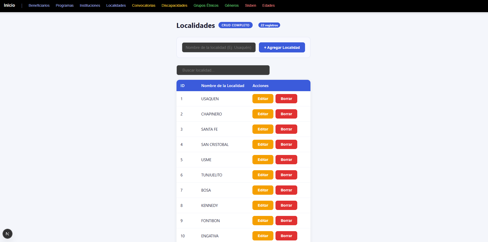

---

### 📢 Convocatorias
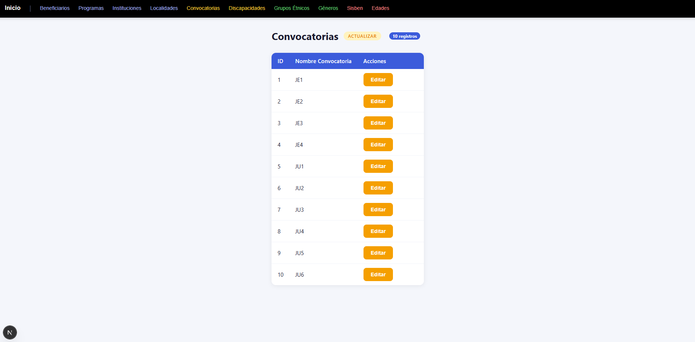

---

### ♿ Discapacidades
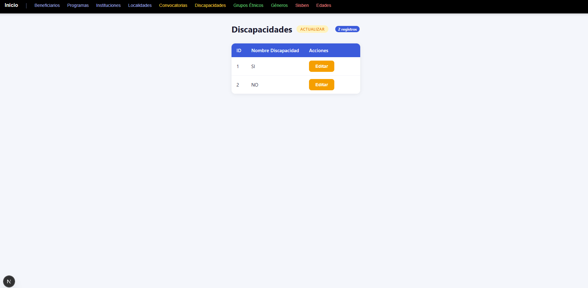

---

### 🌎 Grupos Étnicos
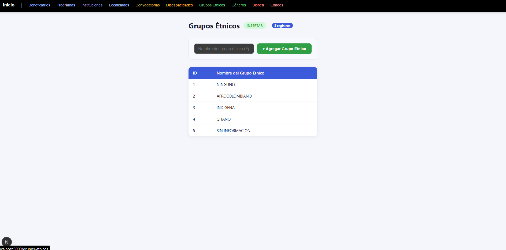

---

### 🚻 Géneros
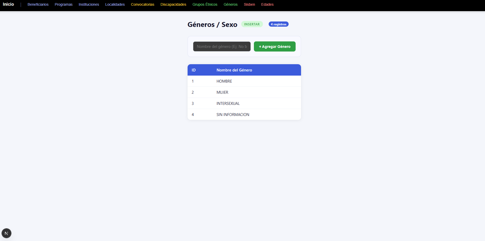

---

### 🧾 SISBEN
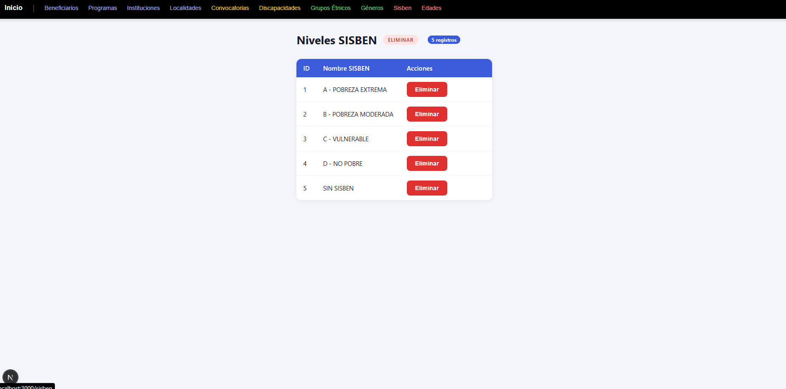

---

### 👶 Edades
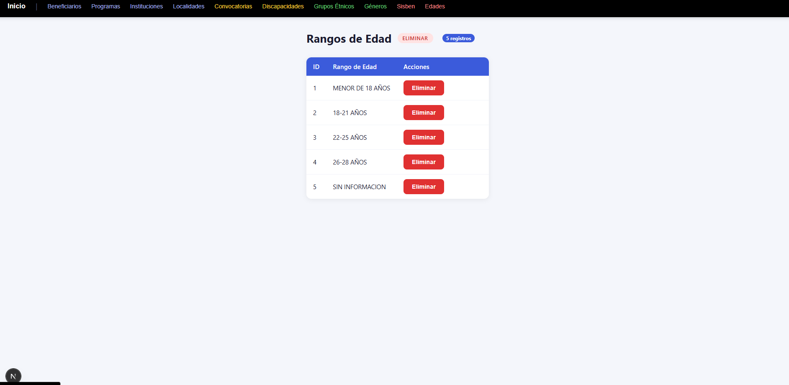

## 🚀 Funcionalidades

- Consulta de beneficiarios
- Consulta de programas
- Consulta de Instituciones
- CRUD de Localidades
- Editar y Actualizar Convocatorias
- Editar y Actualizar Discapacidades
- Insetar Grupos Etnicos
- Insertar Generos
- Eliminar Sisben
- Eliminar Edades

---

## 👨‍💻 Autor

Jhanpol Parra Barreto - Desarrollador de Software
Developer Full Stack